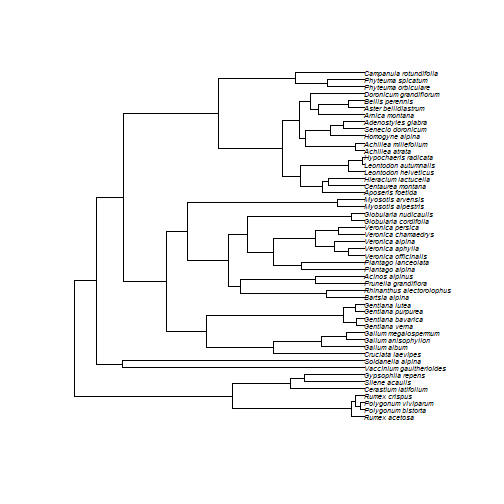
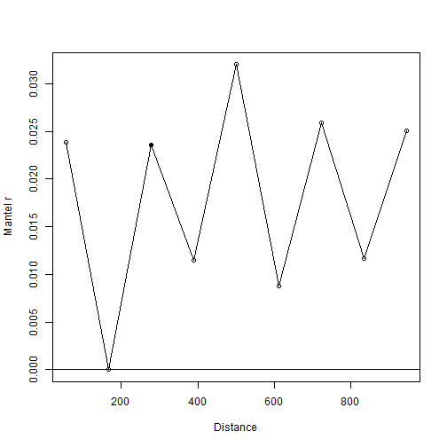

=========================================================
**Valeria Di Cola, Olivier Broennimann, Blaise Petitpierre, Manuela D'Amen, Frank Breiner & Antoine Guisan**
##### 08 November, 2017

Miscellaneous methods and utilities for spatial ecology analysis, written by current and former members and collaborators of the ecospat group of Antoine Guisan, Department of Ecology and Evolution (DEE) & Institute of Earth Surface Dynamics (IDYST), University of Lausanne, Switzerland.

*ecospat* offers the possibility to perform Pre-modelling Analysis, such as Spatial autocorrelation analysis, MESS (Multivariate Environmental Similarity Surfaces) analyses, Phylogenetic diversity Measures, Biotic Interactions. It also provides functions to complement *biomod2* in preparing the data, calibrating and evaluating (e.g. boyce index) and projecting the models. Complementary analysis based on model predictions (e.g. co-occurrences analyses) are also provided.

In addition, the *ecospat* package includes Niche Quantification and Overlap functions that were used in Broennimann et al. 2012 and Petitpierre et al. 2012 to quantify climatic niche shifts between the native and invaded ranges of invasive species.


# Load data


```r
library(ecospat)
```

```
## Loading required package: ade4
```

```
## Loading required package: ape
```

```
## Loading required package: gbm
```

```
## Loading required package: survival
```

```
## Loading required package: lattice
```

```
## Loading required package: splines
```

```
## Loading required package: parallel
```

```
## Loaded gbm 2.1.1
```

```
## Loading required package: sp
```

```r
citation("ecospat")
```

```
## 
## To cite package 'ecospat' in publications use:
## 
##   Olivier Broennimann, Valeria Di Cola and Antoine Guisan (2017).
##   ecospat: Spatial Ecology Miscellaneous Methods. R package
##   version 2.2.0.
##   http://www.unil.ch/ecospat/home/menuguid/ecospat-resources/tools.html
## 
## A BibTeX entry for LaTeX users is
## 
##   @Manual{,
##     title = {ecospat: Spatial Ecology Miscellaneous Methods},
##     author = {Olivier Broennimann and Valeria {Di Cola} and Antoine Guisan},
##     year = {2017},
##     note = {R package version 2.2.0},
##     url = {http://www.unil.ch/ecospat/home/menuguid/ecospat-resources/tools.html},
##   }
```

### Test data for the ecospat library 
*ecospat.testData()*

```r
data(ecospat.testData)
names(ecospat.testData)
```

```
##  [1] "numplots"                      "long"                         
##  [3] "lat"                           "ddeg"                         
##  [5] "mind"                          "srad"                         
##  [7] "slp"                           "topo"                         
##  [9] "Achillea_atrata"               "Achillea_millefolium"         
## [11] "Acinos_alpinus"                "Adenostyles_glabra"           
## [13] "Aposeris_foetida"              "Arnica_montana"               
## [15] "Aster_bellidiastrum"           "Bartsia_alpina"               
## [17] "Bellis_perennis"               "Campanula_rotundifolia"       
## [19] "Centaurea_montana"             "Cerastium_latifolium"         
## [21] "Cruciata_laevipes"             "Doronicum_grandiflorum"       
## [23] "Galium_album"                  "Galium_anisophyllon"          
## [25] "Galium_megalospermum"          "Gentiana_bavarica"            
## [27] "Gentiana_lutea"                "Gentiana_purpurea"            
## [29] "Gentiana_verna"                "Globularia_cordifolia"        
## [31] "Globularia_nudicaulis"         "Gypsophila_repens"            
## [33] "Hieracium_lactucella"          "Homogyne_alpina"              
## [35] "Hypochaeris_radicata"          "Leontodon_autumnalis"         
## [37] "Leontodon_helveticus"          "Myosotis_alpestris"           
## [39] "Myosotis_arvensis"             "Phyteuma_orbiculare"          
## [41] "Phyteuma_spicatum"             "Plantago_alpina"              
## [43] "Plantago_lanceolata"           "Polygonum_bistorta"           
## [45] "Polygonum_viviparum"           "Prunella_grandiflora"         
## [47] "Rhinanthus_alectorolophus"     "Rumex_acetosa"                
## [49] "Rumex_crispus"                 "Vaccinium_gaultherioides"     
## [51] "Veronica_alpina"               "Veronica_aphylla"             
## [53] "Agrostis_capillaris"           "Bromus_erectus_sstr"          
## [55] "Campanula_scheuchzeri"         "Carex_sempervirens"           
## [57] "Cynosurus_cristatus"           "Dactylis_glomerata"           
## [59] "Daucus_carota"                 "Festuca_pratensis_sl"         
## [61] "Geranium_sylvaticum"           "Leontodon_hispidus_sl"        
## [63] "Potentilla_erecta"             "Pritzelago_alpina_sstr"       
## [65] "Prunella_vulgaris"             "Ranunculus_acris_sl"          
## [67] "Saxifraga_oppositifolia"       "Soldanella_alpina"            
## [69] "Taraxacum_officinale_aggr"     "Trifolium_repens_sstr"        
## [71] "Veronica_chamaedrys"           "Parnassia_palustris"          
## [73] "glm_Agrostis_capillaris"       "glm_Leontodon_hispidus_sl"    
## [75] "glm_Dactylis_glomerata"        "glm_Trifolium_repens_sstr"    
## [77] "glm_Geranium_sylvaticum"       "glm_Ranunculus_acris_sl"      
## [79] "glm_Prunella_vulgaris"         "glm_Veronica_chamaedrys"      
## [81] "glm_Taraxacum_officinale_aggr" "glm_Plantago_lanceolata"      
## [83] "glm_Potentilla_erecta"         "glm_Carex_sempervirens"       
## [85] "glm_Soldanella_alpina"         "glm_Cynosurus_cristatus"      
## [87] "glm_Campanula_scheuchzeri"     "glm_Festuca_pratensis_sl"     
## [89] "glm_Bromus_erectus_sstr"       "glm_Saxifraga_oppositifolia"  
## [91] "glm_Daucus_carota"             "glm_Pritzelago_alpina_sstr"   
## [93] "gbm_Bromus_erectus_sstr"       "gbm_Saxifraga_oppositifolia"  
## [95] "gbm_Daucus_carota"             "gbm_Pritzelago_alpina_sstr"
```

### Test data for the Niche Overlap Analysis
*ecospat.testNiche.inv()*

```r
data(ecospat.testNiche.inv)
names(ecospat.testNiche.inv)
```

```
##  [1] "x"           "y"           "aetpet"      "gdd"         "p"          
##  [6] "pet"         "stdp"        "tmax"        "tmin"        "tmp"        
## [11] "species_occ" "predictions"
```

ecospat.testNiche.nat()

```r
data(ecospat.testNiche.nat)
names(ecospat.testNiche.nat)
```

```
##  [1] "x"           "y"           "aetpet"      "gdd"         "p"          
##  [6] "pet"         "stdp"        "tmax"        "tmin"        "tmp"        
## [11] "species_occ" "predictions"
```

### Test tree for Phylogenetic Diversity Analysis

*ecospat.testTree()*

```r
fpath <- system.file("extdata", "ecospat.testTree.tre", package="ecospat")
fpath
```

```
## [1] "C:/Users/obroenni/Documents/ecospat/ecospat.Rcheck/ecospat/extdata/ecospat.testTree.tre"
```

```r
tree<-read.tree(fpath)
tree$tip.label
```

```
##  [1] "Rumex_acetosa"             "Polygonum_bistorta"       
##  [3] "Polygonum_viviparum"       "Rumex_crispus"            
##  [5] "Cerastium_latifolium"      "Silene_acaulis"           
##  [7] "Gypsophila_repens"         "Vaccinium_gaultherioides" 
##  [9] "Soldanella_alpina"         "Cruciata_laevipes"        
## [11] "Galium_album"              "Galium_anisophyllon"      
## [13] "Galium_megalospermum"      "Gentiana_verna"           
## [15] "Gentiana_bavarica"         "Gentiana_purpurea"        
## [17] "Gentiana_lutea"            "Bartsia_alpina"           
## [19] "Rhinanthus_alectorolophus" "Prunella_grandiflora"     
## [21] "Acinos_alpinus"            "Plantago_alpina"          
## [23] "Plantago_lanceolata"       "Veronica_officinalis"     
## [25] "Veronica_aphylla"          "Veronica_alpina"          
## [27] "Veronica_chamaedrys"       "Veronica_persica"         
## [29] "Globularia_cordifolia"     "Globularia_nudicaulis"    
## [31] "Myosotis_alpestris"        "Myosotis_arvensis"        
## [33] "Aposeris_foetida"          "Centaurea_montana"        
## [35] "Hieracium_lactucella"      "Leontodon_helveticus"     
## [37] "Leontodon_autumnalis"      "Hypochaeris_radicata"     
## [39] "Achillea_atrata"           "Achillea_millefolium"     
## [41] "Homogyne_alpina"           "Senecio_doronicum"        
## [43] "Adenostyles_glabra"        "Arnica_montana"           
## [45] "Aster_bellidiastrum"       "Bellis_perennis"          
## [47] "Doronicum_grandiflorum"    "Phyteuma_orbiculare"      
## [49] "Phyteuma_spicatum"         "Campanula_rotundifolia"
```
Plot tree

```r
plot(tree, cex=0.6)
```




# Pre-Modelling Analysis


## Spatial Auto-correlation

### Mantel Correlogram with *ecospat.mantel.correlogram()*

```r
ecospat.mantel.correlogram(dfvar=ecospat.testData[c(2:16)],colxy=1:2, n=100, 
                           colvar=3:7, max=1000, nclass=10, nperm=100)
```



The graph indicates that spatial autocorrelation (SA) is minimal at a distance of 180 meters. Note however that SA is not significantly different than zero for several distances (open circles).


## Predictor Variable Selection
### Number of Predictors with Pearson Correlation *ecospat.npred()*

```r
colvar <- ecospat.testData[c(4:8)]
x <- cor(colvar, method="pearson")
ecospat.npred (x, th=0.75)
```

```
## [1] 4
```


### Number of Predictors with Spearman Correlation *ecospat.npred()*

```r
x <- cor(colvar, method="spearman")
ecospat.npred (x, th=0.75)
```

```
## [1] 4
```


## Climate Analogy Tools


### Climate Analogy with *ecospat.climan()*

```r
x <- ecospat.testData[c(4:8)]
p<- x[1:90,] #A projection dataset.
ref<- x[91:300,] # A reference dataset
```


```r
ecospat.climan(ref,p)
```

```
##  [1]  0.185415746 -0.028290993 -0.032909931 -0.009237875 -0.034642032
##  [6] -0.209006928 -0.084295612 -0.103622863  0.355220600 -0.136258661
## [11] -0.087182448 -0.209006928 -0.143187067 -0.124711316 -0.114844720
## [16] -0.230596451  0.276046242  0.249093277 -0.125288684 -0.101226337
## [21] -0.113883908 -0.204653076 -0.001154734 -0.132217090 -0.100461894
## [26]  0.464738681 -0.416578541 -0.044457275 -0.018475751 -0.122225532
## [31] -0.137611720 -0.050808314  0.254605027 -0.062012319  0.238294633
## [36] -0.159141330 -0.147806005  0.277670365 -0.071593533 -0.019053118
## [41]  0.390781314  0.175132571  0.401892929  0.843703731  0.286155800
## [46]  0.321142114  0.668511130  0.252253209  0.440050672  0.177247206
## [51]  0.831525456  0.303710525  0.197182304  0.219273698  0.196637663
## [56]  0.195300816  0.142395786  0.176988160 -0.051991905  0.265163111
## [61] -0.020785219 -0.017898383  0.553965995  0.409635110  0.323633285
## [66]  0.468693064  0.124983005 -0.032909931  0.165642783  0.147046687
## [71]  0.202895471  0.341992334  0.225508458  0.133254065  0.485295264
## [76] -0.047344111 -0.012282931  0.165429659  0.134199992  0.216655251
## [81]  0.139419127  0.121254775  0.098782992  0.591393741  0.110866239
## [86]  0.146010655  0.095562156  0.093353356  0.081712342  0.160531262
```

### Extrapolation detection, creating a MESS object with *ecospat.mess()*

```r
x <- ecospat.testData[c(2,3,4:8)]
proj<- x[1:90,] #A projection dataset.
cal<- x[91:300,] #A calibration dataset
```


```r
mess.object<-ecospat.mess (proj, cal, w="default")
```

#### Plot MESS with *ecospat.plot.mess()*


